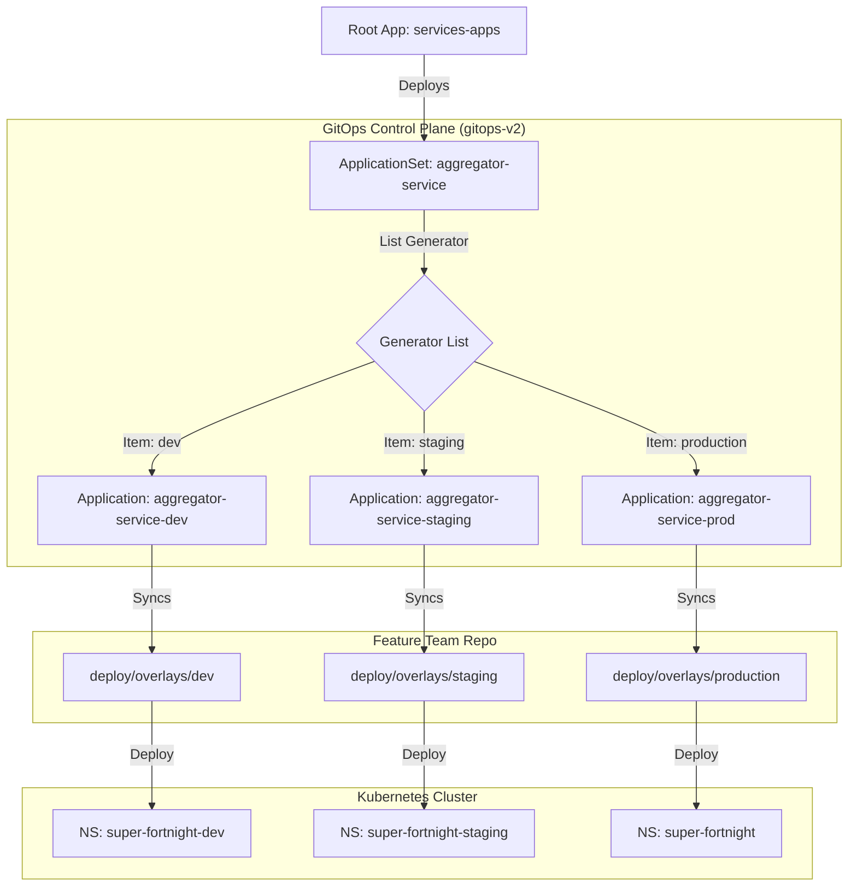

# ArgoCD ApplicationSet Pattern

This document describes our architectural approach to managing multiple environments for microservices using ArgoCD ApplicationSets.

## Overview

We use the **ApplicationSet** pattern to dynamically generate ArgoCD Applications for different environments (dev, staging, production) from a single declarative configuration.

This replaces the traditional "App of Apps" pattern where each environment required a separate Application manifest.

## The Problem

Managing multiple environments per service typically involves:

1. Creating `dev.yaml` for Development
2. Creating `staging.yaml` for Staging
3. Creating `prod.yaml` for Production

This leads to:

- **Code Duplication**: 90% of the YAML is identical.
- **Drift**: Settings applied to one environment might be missed in others.
- **Maintenance Overhead**: Adding a new environment requires creating new files.
- **Complex "State" Management**: Disabling an environment requires deleting files or commenting out code.

## The Solution: List Generator

We use an **ApplicationSet** with a **List Generator** to act as a "Switchboard".

### Architecture



### Configuration Structure

The configuration lives in `gitops-v2/argocd/apps/<service>-appset.yaml`.

```yaml
apiVersion: argoproj.io/v1alpha1
kind: ApplicationSet
metadata:
  name: aggregator-service
spec:
  generators:
    - list:
        elements:
          - env: dev
            namespace: super-fortnight-dev
          - env: staging
            namespace: super-fortnight-staging
          - env: production
            namespace: super-fortnight
  template:
    metadata:
      name: "aggregator-service-{{env}}"
    spec:
      source:
        path: "deploy/overlays/{{env}}"
      destination:
        namespace: "{{namespace}}"
```

## Workflows

### Adding a New Environment

To add a QA environment, simply add an entry to the list:

```yaml
- env: qa
  namespace: super-fortnight-qa
```

ArgoCD will automatically creating the `aggregator-service-qa` Application.

### Removing an Environment (Undeploying)

To undeploy Production (e.g., during major maintenance or decommissioning), simply remove the entry:

```yaml
- env: dev
  namespace: super-fortnight-dev
- env: staging
  namespace: super-fortnight-staging
# - env: production   <-- Removed!
#   namespace: super-fortnight
```

ArgoCD will automatically prune the `aggregator-service-production` Application and all its resources.

## Benefits

1.  **Declarative Control**: State is managed by data, not code presence.
2.  **Scalability**: Zero boilerplate to add new environments.
3.  **Consistency**: All environments share the exact same Application template.
4.  **Simplicity**: Feature teams only need to provide the standard overlays (`deploy/overlays/<env>`).
