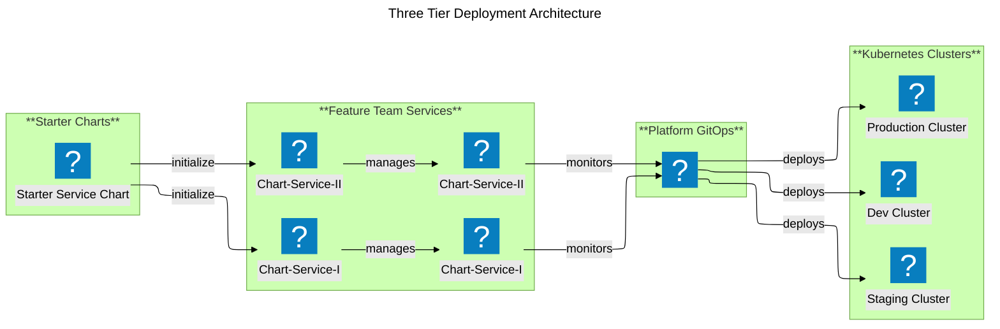

# Cloud-Native Deployment Workflow

## Overview

This document describes the **cloud-native deployment workflow** for Super Fortnight microservices, implementing industry-leading GitOps practices with a **Helm + Kustomize hybrid** approach.

## Architecture Principles

### Design Goals

✅ **Team Autonomy** - Each team owns their service completely  
✅ **DRY Principle** - Eliminate duplication through templating  
✅ **GitOps Native** - Git as single source of truth  
✅ **Environment Parity** - Consistent deployments across environments  
✅ **Selective Adoption** - Teams control when to adopt platform updates

### Three-Tier Architecture



## Repository Structure

### 1. Platform Chart Repository (sf-helm-registry)

**Owner**: Platform Team  
**Purpose**: Centralized Helm chart templates  
**GitHub**: https://github.com/ashutosh-18k92/sf-helm-registry.git

```
sf-helm-registry/
├── charts
│   ├── api                                 # api chart
│   │   ├── Chart.yaml
│   │   ├── README.md
│   │   ├── templates
│   │   │   ├── deployment.yaml
│   │   │   ├── _helpers.tpl
│   │   │   ├── hpa.yaml
│   │   │   ├── ingress.yaml
│   │   │   ├── NOTES.txt
│   │   │   ├── serviceAccount.yaml
│   │   │   ├── service.yaml
│   │   │   └── tests
│   │   │       └── test-connection.yaml
│   │   ├── values.schema.json
│   │   └── values.yaml
│   └── worker                                # worker chart
│       ├── Chart.yaml
│       ├── README.md
│       ├── templates
│       │   ├── deployment.yaml
│       │   ├── _helpers.tpl
│       │   ├── hpa.yaml
│       │   ├── ingress.yaml
│       │   ├── NOTES.txt
│       │   ├── serviceAccount.yaml
│       │   ├── service.yaml
│       │   └── tests
│       │       └── test-connection.yaml
│       ├── values.schema.json
│       └── values.yaml
└── README.md
```

**Features**:

- Production-ready templates
- Affinity rules for HA
- HPA with CPU/memory targets
- Istio service mesh integration
- Standardized labels and annotations

### 2. Team Service Repository (aggregator-service)

**Owner**: Aggregator Team  
**Purpose**: Application code + deployment configuration  
**GitHub**: https://github.com/ashutosh-18k92/aggregator-service.git

```
aggregator-service/
├── charts
│   ├── aggregator
│   │   ├── Chart.yaml
│   │   ├── README.md
│   │   ├── templates
│   │   │   ├── deployment.yaml
│   │   │   ├── _helpers.tpl
│   │   │   ├── hpa.yaml
│   │   │   ├── ingress.yaml
│   │   │   ├── NOTES.txt
│   │   │   ├── serviceAccount.yaml
│   │   │   ├── service.yaml
│   │   │   └── tests
│   │   │       └── test-connection.yaml
│   │   ├── values.schema.json
│   │   └── values.yaml
│   └── ct.yaml
├── deploy
│   ├── environments
│   │   ├── development.yaml
│   │   └── production.todo
│   └── overlays
│       ├── development
│       │   ├── kustomization.yaml
│       │   ├── patches
│       │   │   ├── configmap.yaml
│       │   │   ├── deployment.yaml
│       │   │   ├── service.yaml
│       │   │   └── ingress.yaml
│       │   └── values.yaml
│       └── production
│           ├── kustomization.yaml
│           ├── patches
│           │   ├── deployment-affinity.yaml
│           │   ├── hpa-scaling.yaml
│           │   └── production-resources.yaml
│           └── values.yaml
├── Dockerfile
├── package.json
├── package-lock.json
├── pnpm-lock.yaml
├── README.md
├── src
│   └── index.ts
└── tsconfig.json
```

### 3. GitOps Repository (gitops-v2)

**Owner**: Platform Team  
**Purpose**: ArgoCD application definitions

```
gitops-v2/
└── services/
    ├── aggregator-service.yaml      # ArgoCD App
    └── README.md
```

## Workflow Deep Dive

### Base Values

The `charts/aggregator/values.yaml` file contains the base configuration:

### Testing the Chart

```bash
# Render chart with default values
helm template aggregator ./charts/aggregator

# Render with development values
helm template aggregator ./charts/aggregator \
  -f deploy/overlays/development/values.yaml

# Validate chart
helm lint ./charts/aggregator
```

## Deployment

### Environment Overlays

Each environment has its own overlay in `deploy/overlays/`:

```
deploy/overlays/
└── [environment]/
     ├── kustomization.yaml    # References aggregator chart
     ├── values.yaml           # env-specific values
     └── patches/              # env-specific patches
```

### Example Development Overlay

**File**: `deploy/overlays/development/kustomization.yaml`

```yaml
apiVersion: kustomize.config.k8s.io/v1beta1
kind: Kustomization

helmCharts:
  - name: aggregator
    repo: https://ashutosh-18k92.github.io/aggregator-service
    releaseName: aggregator-service
    namespace: super-fortnight-dev
    valuesFile: values.yaml
    version: v0.1.0
    includeCRDs: false
```

**File**: `deploy/overlays/development/values.yaml`

```yaml
app:
  name: aggregator-service
  component: api
  partOf: superfortnight

environment: development

image:
  tag: "dev-latest"
  pullPolicy: Always

env:
  LOG_LEVEL: "debug"
  NODE_ENV: "development"

autoscaling:
  enabled: false

resources:
  requests:
    memory: "128Mi"
    cpu: "100m"
```

### Environment Overlays

**Production Patches**:

1. **Affinity** - Node and zone spreading for HA
2. **HPA** - 5-20 replicas with CPU/memory targets
3. **Resources** - Increased limits for production load

**Development**:

- 1 replica
- Debug logging
- Minimal resources
- Fast iteration

### ArgoCD Integration

**File**: `gitops-v2/services/aggregator-appset.yaml`

```yaml
apiVersion: argoproj.io/v1alpha1
kind: ApplicationSet
metadata:
  name: aggregator-service
  namespace: argocd
  annotations:
    argocd.argoproj.io/sync-wave: "100"
spec:
  goTemplate: true
  generators:
    - git:
        repoURL: https://github.com/ashutosh-18k92/aggregator-service.git
        revision: main
        files:
          - path: "deploy/environments/*.yaml"

  template:
    metadata:
      name: "aggregator-service-{{.env}}"
      namespace: argocd
      finalizers:
        - resources-finalizer.argocd.argoproj.io

    spec:
      project: default

      # Single source: Kustomize overlay (includes Helm chart + patches)
      source:
        repoURL: https://github.com/ashutosh-18k92/aggregator-service.git
        targetRevision: "{{.targetRevision}}"
        path: deploy/overlays/{{.env}}
        kustomize: {} # Uses global --enable-helm from argocd-cm

      destination:
        server: https://kubernetes.default.svc
        namespace: "{{.namespace}}"

      syncPolicy:
        automated:
          enabled: true
          prune: true
          selfHeal: true

      ignoreDifferences:
        - group: apps
          kind: Deployment
          jsonPointers:
            - /spec/replicas
```

## Team Workflows

### Scenario 1: Application Development

```bash
# Clone team repository
git clone https://github.com/your-org/aggregator-service.git
cd aggregator-service

# Develop feature
vim src/index.ts
npm run dev

# Update deployment config (same PR!)
vim deploy/base/values.yaml
# Update image tag

# Commit both code and config
git add src/ deploy/
git commit -m "Add feature X with deployment config"
git push

# ArgoCD auto-syncs to cluster
```

**Benefits**:

- ✅ Code and deployment in single PR
- ✅ Atomic changes
- ✅ Easy rollback
- ✅ Complete team ownership

### Scenario 2: Should we allow Platform Starter Chart Updates?

**Benefits**:

- ✅ Team controls timing
- ✅ Can test before deploying
- ✅ No forced updates
- ✅ Gradual rollout across teams

### Scenario 3: Custom Configuration (Patches)

> ArgoCD runs into **drift** issue with patches when there is an overlapping configuration between overlays and patches. We should only apply patches for which there exists no configuration in the chart templates. For the configurations that templates are designed to substitute must only be overriden with overlays and not by patches.

```bash
# Add production-specific feature flag
cd deploy/overlays/production

cat > patches/feature-flag.yaml <<EOF
apiVersion: apps/v1
kind: Deployment
metadata:
  name: aggregator-api-v1
spec:
  template:
    spec:
      containers:
        - name: api
          env:
            - name: ENABLE_CACHING
              value: "true"
EOF

vim kustomization.yaml
# declare patch (among other patches)
patches:
  - target: # narrow down the target to patch (best practice)
      kind: Deployment
      name: aggregator-api-v1
    path: patches/feature-flag.yaml


git commit -m "Enable caching in production"
git push
```

**Benefits**:

- ✅ Environment-specific config
- ✅ No base chart modification
- ✅ Preserved across updates
- ✅ Clear separation of concerns

## Platform Team Workflows

### Releasing Base Chart Updates

```bash
# Clone platform chart repository
git clone https://github.com/ashutosh-18k92/sf-helm-registry.git
cd sf-helm-registry/api

# Add new feature
vim templates/deployment.yaml
# Add Prometheus annotations

# Update version
vim Chart.yaml
# version: 0.1.0 → 0.2.0

# Test
helm lint .
helm template test . --dry-run

# Commit and tag
git add .
git commit -m "v0.2.0: Add Prometheus monitoring annotations"
git tag v0.2.0
git push origin main --tags

# Announce to teams
# Teams adopt when ready!
```

### Announcing Updates

```markdown
📢 **API Chart v0.2.0 Released**

**New Features**:

- Prometheus monitoring annotations
- Improved health check defaults
- Updated resource recommendations

**Breaking Changes**: None

**Upgrade**: Update `version: 0.2.0` in your `deploy/base/kustomization.yaml`

**Documentation**: See CHANGELOG.md
```

## Best Practices

### ✅ DO

**Platform Team**:

- Use semantic versioning for chart releases
- Document changes in CHANGELOG
- Test with real services before releasing
- Announce updates to feature teams
- Maintain backward compatibility

**Feature Teams**:

- Pin specific chart versions
- Keep service values minimal
- Use overlays for environment differences
- Test with `kustomize build` before pushing
- Review platform updates before adopting

### ❌ DON'T

**Platform Team**:

- Don't force teams to upgrade
- Don't break compatibility without major version bump
- Don't add service-specific logic to base chart

**Feature Teams**:

- Don't use `latest` for chart version
- Don't duplicate base chart logic
- Don't hardcode values in patches
- Don't skip testing before deployment

## Benefits Achieved

### Team Autonomy

- ✅ Complete ownership of service
- ✅ Single repository for code + deployment
- ✅ Control over platform updates
- ✅ Independent release cycles

### DRY Principle

- ✅ Base chart eliminates duplication
- ✅ Service values: 30 lines (vs 200+ before)
- ✅ Shared templates across all services
- ✅ Consistent patterns

### GitOps Excellence

- ✅ Git as single source of truth
- ✅ Declarative configuration
- ✅ Automated sync via ArgoCD
- ✅ Easy rollback capability
- ✅ Audit trail via Git history

### Environment Management

- ✅ Base values for all environments
- ✅ Environment-specific overlays
- ✅ Production patches for HA
- ✅ Consistent deployment patterns

## Architecture Comparison

| Aspect             | Traditional      | Our Approach                  |
| ------------------ | ---------------- | ----------------------------- |
| **Manifests**      | Plain YAML       | Helm + Kustomize              |
| **Repository**     | Central monorepo | Team-owned per service        |
| **Duplication**    | High             | None (DRY)                    |
| **Team Control**   | Limited          | Complete                      |
| **Updates**        | Forced           | Selective adoption            |
| **Environments**   | Separate files   | Overlays with patches         |
| **Base Templates** | None             | GitHub repository             |
| **Values**         | Hardcoded        | Templated + minimal overrides |

## Verification

### Test Kustomize Build

```bash
cd aggregator-service
kustomize build deploy/overlays/production
```

### Deploy to Cluster

```bash
# Apply ArgoCD application
kubectl apply -f gitops-v2/services/aggregator-service.yaml

# Verify sync status
argocd app get aggregator-service

# Check deployed resources
kubectl get all -n super-fortnight -l app.kubernetes.io/name=aggregator-api-v1
```

## Summary

This workflow represents **best-in-class cloud-native practices**:

✅ **Team Autonomy** - Complete ownership  
✅ **DRY Principle** - Zero duplication  
✅ **GitOps Native** - Git as source of truth  
✅ **Selective Adoption** - Teams control updates  
✅ **Environment Parity** - Consistent deployments  
✅ **Production Ready** - HA, scaling, monitoring

**Result**: Scalable, maintainable, team-friendly deployment workflow! 🚀
