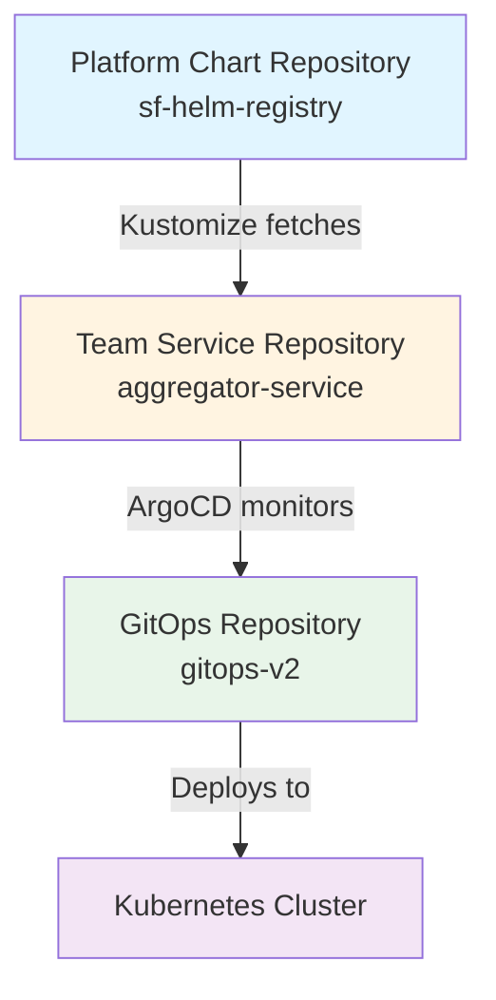

# Cloud-Native Deployment Workflow

## Overview

This document describes the **best-in-class cloud-native deployment workflow** for Super Fortnight microservices, implementing industry-leading GitOps practices with a **Helm + Kustomize hybrid** approach.

## Architecture Principles

### Design Goals

✅ **Team Autonomy** - Each team owns their service completely  
✅ **DRY Principle** - Eliminate duplication through templating  
✅ **GitOps Native** - Git as single source of truth  
✅ **Environment Parity** - Consistent deployments across environments  
✅ **Selective Adoption** - Teams control when to adopt platform updates

### Three-Tier Architecture



## Repository Structure

### 1. Platform Chart Repository (sf-helm-registry)

**Owner**: Platform Team  
**Purpose**: Centralized Helm chart templates  
**GitHub**: https://github.com/ashutosh-18k92/sf-helm-registry.git

```
sf-helm-registry/
└── api/
    ├── Chart.yaml (v0.1.0)
    ├── templates/
    │   ├── deployment.yaml      # Deployment with affinity
    │   ├── service.yaml          # ClusterIP service
    │   ├── hpa.yaml              # Horizontal Pod Autoscaler
    │   ├── istioVirtualService.yaml
    │   └── serviceAccount.yaml
    └── values.yaml               # Base defaults
```

**Features**:

- Production-ready templates
- Affinity rules for HA
- HPA with CPU/memory targets
- Istio service mesh integration
- Standardized labels and annotations

### 2. Team Service Repository (aggregator-service)

**Owner**: Aggregator Team  
**Purpose**: Application code + deployment configuration  
**GitHub**: https://github.com/ashutosh-18k92/aggregator-service.git

```
aggregator-service/
├── src/
│   └── index.ts              # TypeScript/Express application
├── deploy/
│   ├── base/
│   │   ├── kustomization.yaml  # References sf-helm-registry
│   │   └── values.yaml         # Service-specific (30 lines)
│   └── overlays/
│       ├── dev/
│       │   └── kustomization.yaml
│       └── production/
│           ├── kustomization.yaml
│           └── patches/
│               ├── deployment-affinity.yaml
│               ├── hpa-scaling.yaml
│               └── production-resources.yaml
├── package.json
└── README.md
```

**Key Principle**: Only 30 lines of service-specific configuration!

### 3. GitOps Repository (gitops-v2)

**Owner**: Platform Team  
**Purpose**: ArgoCD application definitions

```
gitops-v2/
└── services/
    ├── aggregator-service.yaml      # ArgoCD App (production)
    ├── aggregator-service-dev.yaml  # ArgoCD App (dev)
    └── README.md
```

## Workflow Deep Dive

### Base Chart Configuration

**File**: `aggregator-service/deploy/base/kustomization.yaml`

```yaml
apiVersion: kustomize.config.k8s.io/v1beta1
kind: Kustomization

helmCharts:
  - name: api
    repo: https://github.com/ashutosh-18k92/sf-helm-registry.git
    releaseName: aggregator
    namespace: super-fortnight
    valuesFile: values.yaml
    version: 0.1.0 # Team controls version!
    includeCRDs: false
```

**File**: `aggregator-service/deploy/base/values.yaml`

```yaml
# Only service-specific overrides (30 lines total)
containerPort: 3000
image:
  repository: "aggregator-service"
env:
  SERVICE_NAME: "aggregator-service"
virtualService:
  hosts:
    - aggregator
healthCheck:
  livenessProbe:
    httpGet:
      port: 3000
  readinessProbe:
    httpGet:
      port: 3000
```

### Environment Overlays

**Production Patches**:

1. **Affinity** - Node and zone spreading for HA
2. **HPA** - 5-20 replicas with CPU/memory targets
3. **Resources** - Increased limits for production load

**Development**:

- 1 replica
- Debug logging
- Minimal resources
- Fast iteration

### ArgoCD Integration

**File**: `gitops-v2/services/aggregator-service.yaml`

```yaml
apiVersion: argoproj.io/v1alpha1
kind: Application
metadata:
  name: aggregator-service
  namespace: argocd
spec:
  source:
    repoURL: https://github.com/ashutosh-18k92/aggregator-service.git
    targetRevision: main
    path: deploy/overlays/production
    kustomize:
      version: v5.0.0
  destination:
    server: https://kubernetes.default.svc
    namespace: super-fortnight
  syncPolicy:
    automated:
      prune: true
      selfHeal: true
```

## Team Workflows

### Scenario 1: Application Development

```bash
# Clone team repository
git clone https://github.com/your-org/aggregator-service.git
cd aggregator-service

# Develop feature
vim src/index.ts
npm run dev

# Update deployment config (same PR!)
vim deploy/base/values.yaml
# Update image tag

# Commit both code and config
git add src/ deploy/
git commit -m "Add feature X with deployment config"
git push

# ArgoCD auto-syncs to cluster
```

**Benefits**:

- ✅ Code and deployment in single PR
- ✅ Atomic changes
- ✅ Easy rollback
- ✅ Complete team ownership

### Scenario 2: Adopting Platform Updates

```bash
# Platform team releases API chart v0.2.0
# Team reviews changelog and decides to adopt

cd aggregator-service/deploy/base
vim kustomization.yaml
# Change: version: 0.1.0 → 0.2.0

# Test locally
kustomize build ../overlays/production

# Verify changes
kustomize build ../overlays/production | kubectl diff -f -

# Commit when satisfied
git commit -m "Adopt API chart v0.2.0 - adds new monitoring labels"
git push
```

**Benefits**:

- ✅ Team controls timing
- ✅ Can test before deploying
- ✅ No forced updates
- ✅ Gradual rollout across teams

### Scenario 3: Custom Configuration

```bash
# Add production-specific feature flag
cd deploy/overlays/production

cat > patches/feature-flag.yaml <<EOF
apiVersion: apps/v1
kind: Deployment
metadata:
  name: aggregator-api-v1
spec:
  template:
    spec:
      containers:
        - name: api
          env:
            - name: ENABLE_CACHING
              value: "true"
EOF

vim kustomization.yaml
# Add: - patches/feature-flag.yaml

git commit -m "Enable caching in production"
git push
```

**Benefits**:

- ✅ Environment-specific config
- ✅ No base chart modification
- ✅ Preserved across updates
- ✅ Clear separation of concerns

## Platform Team Workflows

### Releasing Base Chart Updates

```bash
# Clone platform chart repository
git clone https://github.com/ashutosh-18k92/sf-helm-registry.git
cd sf-helm-registry/api

# Add new feature
vim templates/deployment.yaml
# Add Prometheus annotations

# Update version
vim Chart.yaml
# version: 0.1.0 → 0.2.0

# Test
helm lint .
helm template test . --dry-run

# Commit and tag
git add .
git commit -m "v0.2.0: Add Prometheus monitoring annotations"
git tag v0.2.0
git push origin main --tags

# Announce to teams
# Teams adopt when ready!
```

### Announcing Updates

```markdown
📢 **API Chart v0.2.0 Released**

**New Features**:

- Prometheus monitoring annotations
- Improved health check defaults
- Updated resource recommendations

**Breaking Changes**: None

**Upgrade**: Update `version: 0.2.0` in your `deploy/base/kustomization.yaml`

**Documentation**: See CHANGELOG.md
```

## Best Practices

### ✅ DO

**Platform Team**:

- Use semantic versioning for chart releases
- Document changes in CHANGELOG
- Test with real services before releasing
- Announce updates to feature teams
- Maintain backward compatibility

**Feature Teams**:

- Pin specific chart versions
- Keep service values minimal
- Use overlays for environment differences
- Test with `kustomize build` before pushing
- Review platform updates before adopting

### ❌ DON'T

**Platform Team**:

- Don't force teams to upgrade
- Don't break compatibility without major version bump
- Don't add service-specific logic to base chart

**Feature Teams**:

- Don't use `latest` for chart version
- Don't duplicate base chart logic
- Don't hardcode values in patches
- Don't skip testing before deployment

## Benefits Achieved

### Team Autonomy

- ✅ Complete ownership of service
- ✅ Single repository for code + deployment
- ✅ Control over platform updates
- ✅ Independent release cycles

### DRY Principle

- ✅ Base chart eliminates duplication
- ✅ Service values: 30 lines (vs 200+ before)
- ✅ Shared templates across all services
- ✅ Consistent patterns

### GitOps Excellence

- ✅ Git as single source of truth
- ✅ Declarative configuration
- ✅ Automated sync via ArgoCD
- ✅ Easy rollback capability
- ✅ Audit trail via Git history

### Environment Management

- ✅ Base values for all environments
- ✅ Environment-specific overlays
- ✅ Production patches for HA
- ✅ Consistent deployment patterns

## Architecture Comparison

| Aspect             | Traditional      | Our Approach                  |
| ------------------ | ---------------- | ----------------------------- |
| **Manifests**      | Plain YAML       | Helm + Kustomize              |
| **Repository**     | Central monorepo | Team-owned per service        |
| **Duplication**    | High             | None (DRY)                    |
| **Team Control**   | Limited          | Complete                      |
| **Updates**        | Forced           | Selective adoption            |
| **Environments**   | Separate files   | Overlays with patches         |
| **Base Templates** | None             | GitHub repository             |
| **Values**         | Hardcoded        | Templated + minimal overrides |

## Verification

### Test Kustomize Build

```bash
cd aggregator-service
kustomize build deploy/overlays/production
```

### Deploy to Cluster

```bash
# Apply ArgoCD application
kubectl apply -f gitops-v2/services/aggregator-service.yaml

# Verify sync status
argocd app get aggregator-service

# Check deployed resources
kubectl get all -n super-fortnight -l app.kubernetes.io/name=aggregator-api-v1
```

## Summary

This workflow represents **best-in-class cloud-native practices**:

✅ **Team Autonomy** - Complete ownership  
✅ **DRY Principle** - Zero duplication  
✅ **GitOps Native** - Git as source of truth  
✅ **Selective Adoption** - Teams control updates  
✅ **Environment Parity** - Consistent deployments  
✅ **Production Ready** - HA, scaling, monitoring

**Result**: Scalable, maintainable, team-friendly deployment workflow! 🚀
