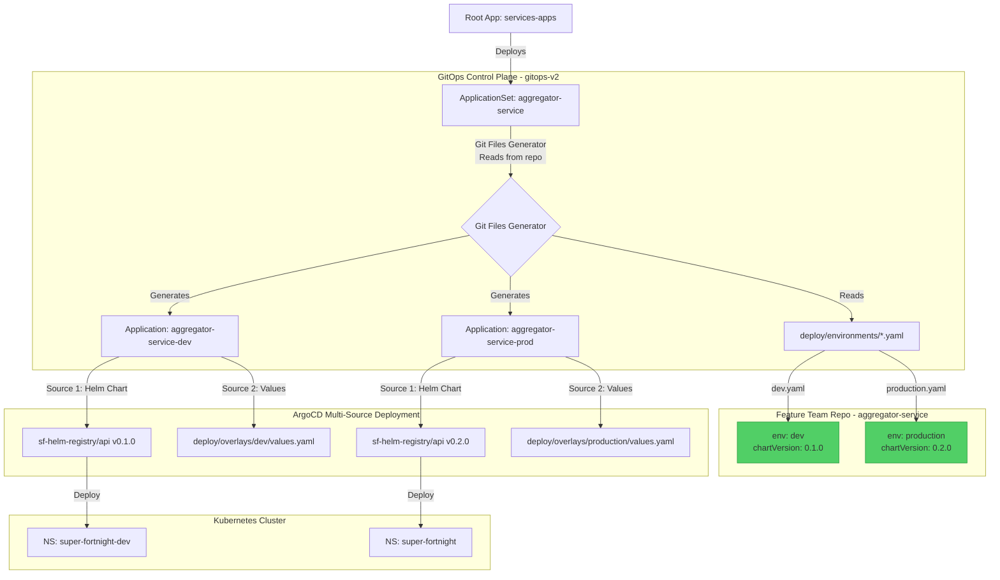

# ArgoCD ApplicationSet Pattern: Git Files Generator

> [!CAUTION]
> **This pattern is DEPRECATED and no longer recommended.**
>
> This document describes an older approach that has been replaced by the **[Decentralized Helm Charts Pattern](../../guides/service-specific-charts.md)**.
>
> **Why deprecated**: Still relies on remote chart repository, teams can't modify chart templates, complex ApplicationSet configuration.
>
> **Use instead**: [Decentralized Helm Charts Pattern](../../guides/service-specific-charts.md) where each service owns its own chart.

This document describes our architectural approach to managing multiple environments for microservices using ArgoCD ApplicationSets with the **Git Files Generator**.

## Overview

We use the **ApplicationSet** pattern with **Git Files Generator** to dynamically generate ArgoCD Applications for different environments (dev, staging, production) by reading configuration files from the feature team's repository.

This gives **feature teams full autonomy** over:

- Which environments exist
- Which Helm chart version each environment uses
- Environment-specific configuration

## Evolution: From List Generator to Git Files Generator

### The Problem with List Generator

The original List Generator approach had a critical limitation:

```yaml
# Platform team controls everything ❌
spec:
  generators:
    - list:
        elements:
          - env: dev
            namespace: super-fortnight-dev
  sources:
    - repoURL: https://github.com/platform/helm-charts
      targetRevision: main # ← Platform team controls chart version
```

**Issues**:

- ❌ Platform team controls chart versions
- ❌ Teams can't upgrade charts independently
- ❌ Environments hardcoded in ApplicationSet
- ❌ No team autonomy

### The Solution: Git Files Generator + Multi-Source

```yaml
# Feature teams control configuration ✅
spec:
  generators:
    - git:
        repoURL: https://github.com/team/service
        files:
          - path: "deploy/environments/*.yaml"
  sources:
    - repoURL: "{{.chartRepo}}"
      targetRevision: "{{.chartVersion}}" # ← Team controls via env file
```

## Architecture



## Configuration Structure

### Platform Team: ApplicationSet Definition

Located in `gitops-v2/argocd/apps/<service>-appset.yaml`:

```yaml
apiVersion: argoproj.io/v1alpha1
kind: ApplicationSet
metadata:
  name: aggregator-service
  namespace: argocd
spec:
  goTemplate: true
  generators:
    # Git Files Generator - reads from feature team repo
    - git:
        repoURL: https://github.com/ashutosh-18k92/aggregator-service.git
        revision: main
        files:
          - path: "deploy/environments/*.yaml"

  template:
    metadata:
      name: "aggregator-service-{{.env}}"
    spec:
      sources:
        # Source 1: Helm chart with team-controlled version
        - repoURL: "{{.chartRepo}}"
          targetRevision: "{{.chartVersion}}"
          path: "{{.chartPath}}"
          helm:
            releaseName: aggregator
            valueFiles:
              - $values/deploy/base/values.yaml
              - $values/deploy/overlays/{{.env}}/values.yaml

        # Source 2: Values from feature team repo
        - repoURL: https://github.com/ashutosh-18k92/aggregator-service.git
          targetRevision: main
          ref: values

      destination:
        namespace: "{{.namespace}}"
```

### Feature Team: Environment Configuration

Located in `aggregator-service/deploy/environments/`:

**`dev.yaml`**:

```yaml
env: dev
namespace: super-fortnight-dev

# Team controls chart version
chartRepo: https://github.com/ashutosh-18k92/sf-helm-registry.git
chartVersion: "0.1.0"
chartPath: api
```

**`production.yaml`**:

```yaml
env: production
namespace: super-fortnight

# Can use different version than dev
chartRepo: https://github.com/ashutosh-18k92/sf-helm-registry.git
chartVersion: "0.2.0"
chartPath: api
```

## Team Workflows

### Adding a New Environment

Feature teams add environments themselves:

```bash
cd aggregator-service

# Create environment config
cat > deploy/environments/qa.yaml <<EOF
env: qa
namespace: super-fortnight-qa
chartRepo: https://github.com/ashutosh-18k92/sf-helm-registry.git
chartVersion: "0.1.0"
chartPath: api
EOF

# Commit and push
git add deploy/environments/qa.yaml
git commit -m "Add QA environment"
git push
```

ArgoCD automatically creates `aggregator-service-qa` Application!

### Upgrading Chart Version

Teams upgrade chart versions independently:

```bash
# Edit environment config
vim deploy/environments/production.yaml

# Change:
# chartVersion: "0.1.0"
# To:
# chartVersion: "0.2.0"

git commit -m "Upgrade production to API chart v0.2.0"
git push
```

ArgoCD automatically syncs the new chart version.

### Removing an Environment

```bash
git rm deploy/environments/qa.yaml
git commit -m "Remove QA environment"
git push
```

ArgoCD automatically prunes the Application and all resources.

## Multi-Source Helm Pattern

### Why Not Kustomize helmCharts?

Kustomize's `helmCharts` feature is **incompatible with Helm 4.x**:

```yaml
# BROKEN with Helm 4.x ❌
helmCharts:
  - name: api
    repo: https://github.com/team/helm-registry.git
    version: 0.1.0
```

**Error**: `unknown shorthand flag: 'c' in -c`

Kustomize tries to run `helm version -c --short`, but Helm 4.x removed the `-c` flag.

### Solution: ArgoCD Multi-Source

Use ArgoCD's native multi-source support:

```yaml
sources:
  # Source 1: Helm chart
  - repoURL: https://github.com/team/helm-registry.git
    path: api
    helm:
      valueFiles:
        - $values/deploy/base/values.yaml

  # Source 2: Values repository
  - repoURL: https://github.com/team/service
    ref: values
```

**Benefits**:

- ✅ Works with Helm 4.x
- ✅ Direct Helm chart rendering
- ✅ No Kustomize helmCharts dependency
- ✅ Clean separation of concerns

## Benefits

| Aspect                    | List Generator      | Git Files Generator  |
| ------------------------- | ------------------- | -------------------- |
| **Chart Version Control** | Platform Team       | Feature Team ✅      |
| **Environment Config**    | ApplicationSet      | Feature Team Repo ✅ |
| **Add New Environment**   | Edit ApplicationSet | Add YAML file ✅     |
| **Team Autonomy**         | Low                 | High ✅              |
| **Helm 4.x Compatible**   | N/A                 | Yes ✅               |

### Key Advantages

1. **Team Autonomy**: Feature teams control chart versions and environments
2. **Git-Based**: All configuration in version control (feature team repo)
3. **Self-Service**: No platform team involvement for environment changes
4. **Helm 4.x Compatible**: Uses ArgoCD multi-source, not Kustomize helmCharts
5. **Gradual Rollout**: Test new chart versions in dev before production
6. **Scalability**: Zero boilerplate to add new environments
7. **Consistency**: All environments share the same Application template

## Repository Structure

```
Feature Team Repo (aggregator-service)
├── deploy/
│   ├── environments/          # ← Team controls
│   │   ├── dev.yaml          # Dev config + chart version
│   │   ├── staging.yaml      # Staging config + chart version
│   │   └── production.yaml   # Prod config + chart version
│   ├── base/
│   │   └── values.yaml       # Base Helm values
│   └── overlays/
│       ├── dev/
│       │   └── values.yaml   # Dev-specific values
│       └── production/
│           └── values.yaml   # Prod-specific values

Platform Repo (gitops-v2)
└── argocd/
    └── apps/
        └── aggregator-appset.yaml  # ApplicationSet definition
```

## Migration from List Generator

If migrating from List Generator:

1. **Create environment files** in feature team repo
2. **Update ApplicationSet** to use Git Files Generator
3. **Test** with one environment first
4. **Rollout** to all environments

> [!NOTE]
> This pattern is deprecated. See [Decentralized Helm Charts Pattern](../../guides/service-specific-charts.md) for the current recommended approach.
