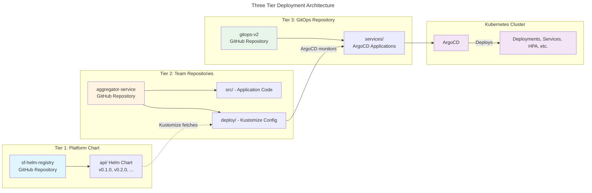

# Three-Tier Architecture

## Overview

Super Fortnight implements a **three-tier architecture** that separates concerns between platform infrastructure, team-owned services, and GitOps orchestration.

This architecture enables **team autonomy**, **selective adoption**, and **GitOps excellence**.

## Architecture Diagram



## Tier 1: Platform Chart Repository

### Purpose

Centralized Helm chart templates maintained by the **Platform Team**.

### Repository

**GitHub**: https://github.com/ashutosh-18k92/sf-helm-registry.git

### Structure

```
sf-helm-registry/
└── api/
    ├── Chart.yaml              # Semantic versioning (v0.1.0, v0.2.0, ...)
    ├── values.yaml             # Base defaults
    ├── values.dev.yaml         # Development defaults
    ├── values.stage.yaml       # Staging defaults
    ├── values.prod.yaml        # Production defaults
    ├── values.schema.json      # Values validation
    └── templates/
        ├── deployment.yaml
        ├── service.yaml
        ├── hpa.yaml
        ├── istioVirtualService.yaml
        ├── serviceAccount.yaml
        └── _helpers.tpl
```

### Responsibilities

- **Platform Team** maintains templates
- **Semantic versioning** for releases (v0.1.0, v0.2.0, etc.)
- **Production-ready** templates with best practices:
  - Affinity rules for HA
  - HPA with CPU/memory targets
  - Istio service mesh integration
  - Standardized labels and annotations

### Workflow

```bash
# Platform team updates chart
cd sf-helm-registry/api
vim templates/deployment.yaml

# Bump version
vim Chart.yaml  # version: 0.1.0 → 0.2.0

# Tag and release
git commit -m "v0.2.0: Add feature"
git tag v0.2.0
git push origin main --tags
```

---

## Tier 2: Team Service Repositories

### Purpose

Application code and deployment configuration owned by **Feature Teams**.

### Example Repository

**GitHub**: https://github.com/ashutosh-18k92/aggregator-service.git

### Structure

```
aggregator-service/
├── src/
│   └── index.ts                # Application code (TypeScript/Express)
├── deploy/
│   ├── base/
│   │   ├── kustomization.yaml  # References Tier 1 chart
│   │   └── values.yaml         # Service-specific values (30 lines)
│   └── overlays/
│       ├── dev/
│       │   └── kustomization.yaml
│       └── production/
│           ├── kustomization.yaml
│           └── patches/
│               ├── deployment-affinity.yaml
│               ├── hpa-scaling.yaml
│               └── production-resources.yaml
├── package.json
├── Dockerfile
└── README.md
```

### Key Files

**deploy/base/kustomization.yaml**:

```yaml
apiVersion: kustomize.config.k8s.io/v1beta1
kind: Kustomization

helmCharts:
  - name: api
    repo: https://github.com/ashutosh-18k92/sf-helm-registry.git
    releaseName: aggregator
    namespace: super-fortnight
    valuesFile: values.yaml
    version: 0.1.0 # Team controls version!
    includeCRDs: false
```

**deploy/base/values.yaml** (only 30 lines!):

```yaml
containerPort: 3000
image:
  repository: "aggregator-service"
env:
  SERVICE_NAME: "aggregator-service"
virtualService:
  hosts:
    - aggregator
healthCheck:
  livenessProbe:
    httpGet:
      port: 3000
  readinessProbe:
    httpGet:
      port: 3000
```

### Responsibilities

- **Feature Teams** own their repositories
- **Application code** and **deployment config** in same repo
- **Control chart version** (selective adoption)
- **Environment-specific patches** via Kustomize overlays

### Workflow

```bash
# Team develops feature
cd aggregator-service
vim src/index.ts

# Update deployment config (same PR!)
vim deploy/base/values.yaml

# Commit both
git add src/ deploy/
git commit -m "Add feature X"
git push

# ArgoCD auto-syncs
```

---

## Tier 3: GitOps Repository

### Purpose

ArgoCD application definitions maintained by **Platform Team**.

### Repository

**GitHub**: gitops-v2 (or gitops-v3)

### Structure

```
gitops-v2/
└── services/
    ├── aggregator-service.yaml      # Production deployment
    ├── aggregator-service-dev.yaml  # Dev deployment
    ├── paper-service.yaml
    ├── rock-service.yaml
    ├── scissor-service.yaml
    └── README.md
```

### Key File

**services/aggregator-service.yaml**:

```yaml
apiVersion: argoproj.io/v1alpha1
kind: Application
metadata:
  name: aggregator-service
  namespace: argocd
spec:
  source:
    repoURL: https://github.com/ashutosh-18k92/aggregator-service.git
    targetRevision: main
    path: deploy/overlays/production # Points to Tier 2
    kustomize:
      version: v5.0.0
  destination:
    server: https://kubernetes.default.svc
    namespace: super-fortnight
  syncPolicy:
    automated:
      prune: true
      selfHeal: true
```

### Responsibilities

- **Platform Team** manages ArgoCD applications
- **Defines which services** are deployed
- **Points to Tier 2** repositories (team-owned)
- **Minimal changes** - only when adding/removing services

### Workflow

```bash
# Add new service
cd gitops-v2/services
cat > new-service.yaml <<EOF
apiVersion: argoproj.io/v1alpha1
kind: Application
metadata:
  name: new-service
  namespace: argocd
spec:
  source:
    repoURL: https://github.com/org/new-service.git
    path: deploy/overlays/production
    kustomize:
      version: v5.0.0
  destination:
    namespace: super-fortnight
  syncPolicy:
    automated:
      prune: true
      selfHeal: true
EOF

kubectl apply -f new-service.yaml
```

---

## How the Tiers Interact

### 1. Kustomize Fetches Platform Chart

```
Tier 2 (Team Repo)
  deploy/base/kustomization.yaml
    ↓
    helmCharts:
      - repo: https://github.com/.../sf-helm-registry.git
        version: 0.1.0
    ↓
Tier 1 (Platform Chart)
  sf-helm-registry/api/
```

### 2. ArgoCD Monitors Team Repository

```
Tier 3 (GitOps Repo)
  gitops-v2/services/aggregator-service.yaml
    ↓
    source:
      repoURL: https://github.com/.../aggregator-service.git
      path: deploy/overlays/production
    ↓
Tier 2 (Team Repo)
  aggregator-service/deploy/overlays/production/
```

### 3. ArgoCD Deploys to Kubernetes

```
Tier 3 (ArgoCD)
  ↓
  Renders: Tier 1 chart + Tier 2 values + Tier 2 patches
  ↓
Kubernetes Cluster
  Deployment, Service, HPA, VirtualService, etc.
```

## Complete Flow Example

### Platform Team Updates Chart

```bash
# Tier 1: Platform team releases v0.2.0
cd sf-helm-registry/api
vim Chart.yaml  # version: 0.2.0
git tag v0.2.0
git push origin main --tags
```

### Feature Team Adopts Update

```bash
# Tier 2: Aggregator team adopts v0.2.0
cd aggregator-service/deploy/base
vim kustomization.yaml  # version: 0.1.0 → 0.2.0
git commit -m "Adopt API chart v0.2.0"
git push
```

### ArgoCD Deploys

```bash
# Tier 3: ArgoCD detects change in Tier 2
# Automatically syncs to cluster
argocd app get aggregator-service
# Status: Synced, Healthy
```

## Benefits of Three-Tier Architecture

### Clear Separation of Concerns

| Tier   | Owner         | Responsibility                 | Change Frequency |
| ------ | ------------- | ------------------------------ | ---------------- |
| Tier 1 | Platform Team | Base chart templates           | Low (monthly)    |
| Tier 2 | Feature Teams | Code + deployment config       | High (daily)     |
| Tier 3 | Platform Team | ArgoCD application definitions | Low (quarterly)  |

### Team Autonomy

- ✅ Service teams **never touch** Tier 1 or Tier 3
- ✅ Teams work **exclusively in Tier 2** (their repository)
- ✅ Teams **control** when to adopt Tier 1 updates
- ✅ **No dependencies** on platform team for deployments

### Selective Adoption

- ✅ Platform releases chart v0.2.0
- ✅ Aggregator team adopts immediately
- ✅ Paper team stays on v0.1.0
- ✅ **Each team decides** when to upgrade

### GitOps Excellence

- ✅ **Git as source of truth** for all three tiers
- ✅ **Declarative configuration** at every level
- ✅ **Automated sync** via ArgoCD
- ✅ **Audit trail** via Git history

## Summary

The three-tier architecture provides:

1. **Tier 1 (Platform Chart)**: Centralized, versioned templates
2. **Tier 2 (Team Repositories)**: Application code + minimal deployment config
3. **Tier 3 (GitOps Repository)**: ArgoCD orchestration

**Result**: Scalable, maintainable, team-friendly architecture! 🚀

## Related Documentation

- [Cloud-Native Workflow](cloud-native-workflow.md)
- [Helm + Kustomize Hybrid](helm-kustomize-hybrid.md)
- [Platform Team Guide](../guides/platform-team-guide.md)
- [Feature Team Guide](../guides/feature-team-guide.md)
